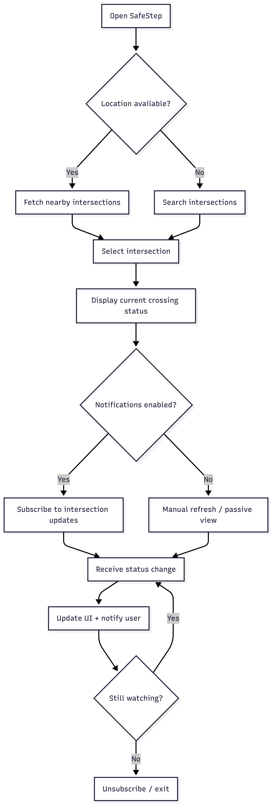
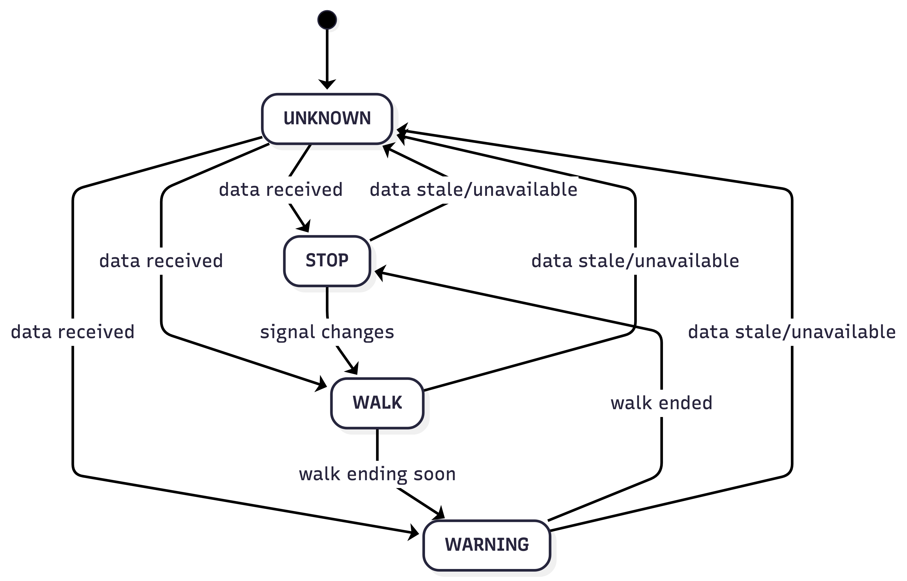

# RiverHacks 2025 - SafeStep

## Business Context

Austin is a rapidly growing city with dense traffic and increasingly complex intersections. For pedestrians, knowing when it is safe to cross can be unclear and stressful. SafeStep is a mobile app designed to notify users when it is safe to cross signalized intersections, helping reduce uncertainty, improve timing, and make city navigation safer and more accessible.

## User Story

**_As a_** pedestrian

**_I want_** to be notified when it is safe to cross an intersection

**_So That_** I can cross streets confidently and avoid oncoming traffic.

## Challenge Area

**Inclusive Accessibility**: ​Ensure safety information and services reach all residents, including those with disabilities

**Smart Infrastructure:** Enhance the safety and accessibility of Austin's public spaces and transportation systems

## Technologies

- React Native
- Typescript

## System Design

### Requirements

**Functional (MVP)**

- Users should be able to set their current intersection by searching or choosing from a nearby list.
- Users can view the current crossing status for the selected intersection.
- Users will receive an in-app alert when the crossing status changes.
- Users will see the crossing status refresh automatically while they are actively using the app at an intersection.

**Functional (Next)**

- Users should be able to detect intersections automatically when they arrive near one.
- Users can use destination mode to follow a route and automatically advance to the next intersection.
- Users should be able to save favorite intersections and quickly return to them.
- Users will see a safe fallback state when signal data is unavailable.

**Non-functional**

- Latency: status changes should reach user quickly (goal: < 1–2s once received)
- Reliability: tolerate dropped network; retry with backoff
- Battery: avoid high-frequency GPS + high-frequency polling in background
- Safety UX: never overclaim; always show “Use caution / obey signals”
- Privacy: minimize storage of precise location; avoid retaining history unless user opts in

### Core entities

**Intersection**

- `id`
- `name` (e.g., “Congress Ave & 6th St”)
- `latitude`
- `longitude`
- `city`
- `isActive`
- `createdAt`

**CrossingSignalState**

- `intersectionId`
- `status` → `STOP | WALK | WARNING | UNKNOWN`
- `effectiveAt` (timestamp)
- `expiresAt` (optional)

**Device**

- `id`
- `userId` (nullable)
- `platform` (iOS / Android)
- `pushToken`
- `createdAt`

### APIs

**Intersections**

- `GET /intersections/nearby`
- `GET /intersections/search`
- `GET /intersections/{intersectionId}/signal`

**Devices**

- `POST /devices/register`

### Flow chart

**User Flow**

**Crossing Status State**

## UI

### Color System

**Status Colors (Non-negotiable semantics)**

> These follow global traffic conventions and ISO / MUTCD human-factors standards.

| Status      | Color Name   | Hex       | Meaning               |
| ----------- | ------------ | --------- | --------------------- |
| **WALK**    | Safety Green | `#2E7D32` | Safe / go             |
| **WARNING** | Amber        | `#F9A825` | Caution / ending soon |
| **STOP**    | Signal Red   | `#C62828` | Do not cross          |
| **UNKNOWN** | Neutral Gray | `#616161` | Data unavailable      |

**Accessibility Requirements (Critical)**

> WCAG 2.1 AA minimum contrast: 4.5:1 for body text
> 3:1 for large text (18pt+ or bold 14pt+)

| Background        | Text Color | Contrast |
| ----------------- | ---------- | -------- |
| `#2E7D32` (Green) | `#FFFFFF`  | 5.7:1    |
| `#F9A825` (Amber) | `#000000`  | 12.6:1   |
| `#C62828` (Red)   | `#FFFFFF`  | 5.9:1    |
| `#616161` (Gray)  | `#FFFFFF`  | 7.3:1    |

**Base UI Colors**
| Role | Color | Hex |
| -------------- | ------------ | --------- |
| Background | Off White | `#FAFAFA` |
| Surface / Card | White | `#FFFFFF` |
| Primary Text | Almost Black | `#1C1C1C` |
| Secondary Text | Mid Gray | `#5F6368` |
| Divider | Light Gray | `#E0E0E0` |

**Action Colors**
| Action | Color | Hex |
| ---------------- | ---------- | --------- |
| Primary Action | Blue | `#1565C0` |
| Secondary Action | Gray | `#9E9E9E` |
| Disabled | Light Gray | `#BDBDBD` |

**Notification & Feedback Colors**
| Use | Color | Hex |
| -------------- | ----- | --------- |
| Success | Green | `#2E7D32` |
| Error | Red | `#D32F2F` |
| Warning banner | Amber | `#F9A825` |
| Info | Blue | `#1976D2` |

**Color + Shape Redundancy**

> WCAG requirement

| Status  | Icon                |
| ------- | ------------------- |
| WALK    | ✓ or walking person |
| WARNING | ⚠️                  |
| STOP    | ⛔                  |
| UNKNOWN | ?                   |

**Status Card**

### WALK state

- Background: `#2E7D32`
- Text: `#FFFFFF`
- Icon: ✓
- Label: **WALK**
- Subtext: “Safe to cross”

### WARNING state

- Background: `#F9A825`
- Text: `#000000`
- Icon: ⚠️
- Label: **WARNING**
- Subtext: “Crossing ending soon”

### STOP state

- Background: `#C62828`
- Text: `#FFFFFF`
- Icon: ⛔
- Label: **STOP**
- Subtext: “Do not cross”

### UNKNOWN state

- Background: `#616161`
- Text: `#FFFFFF`
- Icon: ?
- Label: **UNKNOWN**
- Subtext: “Data unavailable — use caution”

## Demo

## Group

- Alex
- Josh
- Luis
- Vanessa
